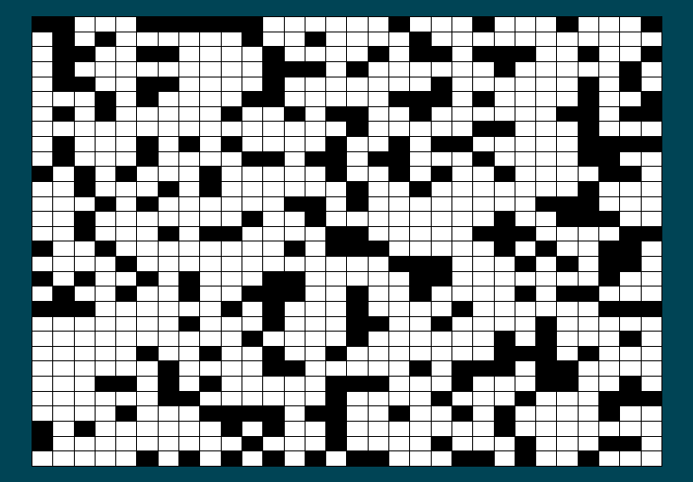
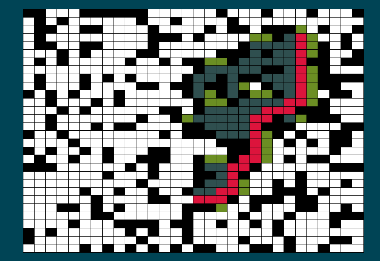

# Astar Labyrinth Solver #
Implementazione Javascript dell'algoritmo A* per il pathfinding all'interno di un labirinto rappresentato come matrice. 
Rispetto ai classici algoritmi di ricerca del percorso che agiscono in ampiezza o in profondità, 
l'algoritmo A* sfrutta un'euristica per non esplorare tutti i nodi! L'ottimalità della soluzione è 
garantita dal fatto che la funzione euristica utilizzata ritorna per ogni elemento della matrice un costo sempre 
minore o uguale al costo reale mancante. Tale funzione è la Distanza di Manhattan: https://it.wikipedia.org/wiki/Geometria_del_taxi

